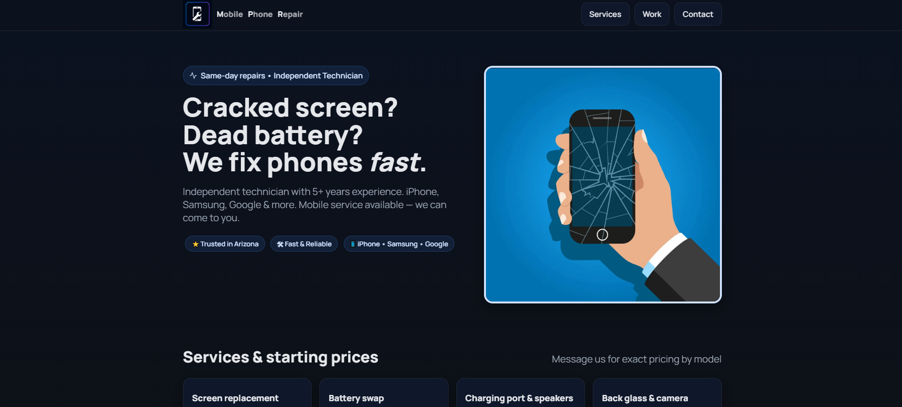

# Mobile Phone Repair Arizona (MPR) 📱

## Description

Mobile Phone Repair Arizona (MPR) is a responsive business website built for a local mobile phone repair service. It was designed to create a professional online presence, allowing customers to easily explore services, compare before/after repairs, and contact the shop for appointments or quotes.

- **Motivation:** To provide a sleek, functional website that highlights repair services and builds trust with local customers.
- **Purpose:** Make it simple for users to view repair examples, find pricing, and contact the technician quickly — even on mobile devices.
- **Problem Solved:** Customers often struggle to find transparent, trustworthy repair shops. This site offers direct communication, live location via Google Maps, and realistic before/after comparisons.

## Table of Contents

- [Usage](#usage)
- [Features](#Features)
- [Credits](#credits)
- [License](#license)

## Usage

Open the site in a web browser to explore repair services and contact information.

Click navigation links (“Services,” “Work,” “Contact”) to scroll smoothly to sections.

Adjust the Before & After sliders to compare real device repairs interactively.

Try the buttons in the Contact section to call, text, or email directly.

Visit the site [Click here!](https://mpraz.com/)

## Features

- Sticky, mobile-friendly navbar with smooth scrolling

- Before/after image comparison sliders

- Clean service cards with starting prices

- Click-to-call, text, and email functionality

- Google Maps location embed

- Dynamic year in footer
## Credits

- Developer: 🚀 Developed by [stephanuh](https://github.com/stephanuh)

- Design Inspiration: Self-created branding and logo for Mobile Phone Repair Arizona

- Tools Used: HTML, CSS, and vanilla JavaScript

## License
This project is licensed for educational and small business use.
© 2025 Mobile Phone Repair Arizona (MPR). All rights reserved.